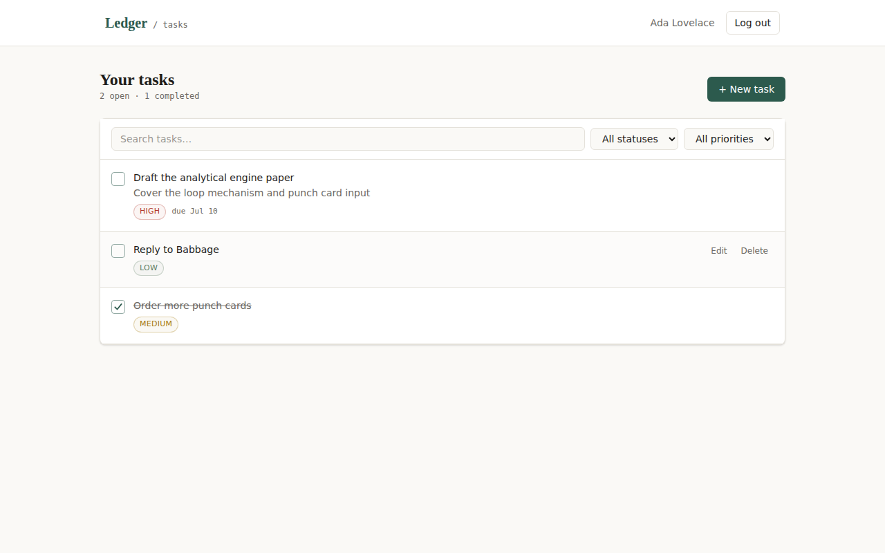

# Task Manager

A full-stack task manager built to demonstrate a complete, production-shaped pattern: a
**React** SPA talking to a **Node.js/Express** REST API, backed by **PostgreSQL**, with
**JWT authentication** and properly protected routes on both ends.



## Features

- **Auth**: register / login with hashed passwords (bcrypt), JWT-based sessions
- **Protected routes**: both API routes (middleware) and frontend routes (redirect to `/login`)
- **Per-user data isolation**: every query is scoped to the logged-in user — verified so
  one account can never read, edit, or delete another account's tasks
- **Task CRUD**: create, edit, complete/uncomplete, delete
- **Filtering**: by status, priority, and free-text search
- **Sorting**: sort by created date, due date, priority, title, or status (ascending / descending)
- **Task statistics**: live counts for total, pending, in-progress, completed, and overdue tasks
- **CSV export**: download your task list (with active filters) as a CSV file
- **Input validation** on the server (`express-validator`) and friendly error states on the client
- **Security defaults**: `helmet`, CORS allow-list, rate limiting on auth endpoints,
  parameterized SQL (no string-built queries), generic error messages in production

## Tech stack

| Layer    | Choice |
|----------|--------|
| Frontend | React 19 + Vite, React Router, Tailwind CSS v4, Axios |
| Backend  | Node.js + Express, JWT, bcrypt, express-validator |
| Database | PostgreSQL (raw `pg`, parameterized SQL — no ORM magic to obscure what's happening) |

## Project structure

```
task-manager/
├── backend/
│   ├── src/
│   │   ├── config/db.js         # PostgreSQL connection pool
│   │   ├── controllers/         # auth + task business logic
│   │   ├── middleware/          # JWT auth guard, validation, error handler
│   │   ├── routes/              # route definitions + validation rules
│   │   ├── db/schema.sql        # table definitions + migration runner
│   │   └── utils/               # ApiError, asyncHandler, JWT helpers
│   ├── server.js
│   └── .env.example
├── frontend/
│   ├── src/
│   │   ├── api/                 # axios client + error helper
│   │   ├── context/AuthContext.jsx
│   │   ├── hooks/useTasks.js
│   │   ├── components/          # Navbar, TaskForm, TaskItem, TaskList, FilterBar, ProtectedRoute
│   │   └── pages/               # LoginPage, RegisterPage, DashboardPage
│   └── .env.example
└── docker-compose.yml           # spins up Postgres only
```

## How to run

### 1. Start PostgreSQL

The easiest path is Docker:

```bash
docker compose up -d
```

This starts Postgres on `localhost:5432` with user `postgres` / password `postgres` and
database `todo_app` — matching the backend's `.env.example` exactly, so no edits are
required if you use it.

No Docker? Install PostgreSQL locally and create a database named `todo_app`, then adjust
`backend/.env` to match your credentials.

### 2. Backend

```bash
cd backend
cp .env.example .env
npm install
npm run migrate   # creates the users & tasks tables
npm run dev        # http://localhost:5000
```

### 3. Frontend

```bash
cd frontend
cp .env.example .env
npm install
npm run dev        # http://localhost:5173
```

Open `http://localhost:5173`, register an account, and start adding tasks.

## API reference

All `/api/tasks` routes require `Authorization: Bearer <token>`.

| Method | Route                | Body / Query                                      | Notes |
|--------|----------------------|----------------------------------------------------|-------|
| POST   | `/api/auth/register` | `{ name, email, password }`                      | Returns `{ user, token }` |
| POST   | `/api/auth/login`    | `{ email, password }`                            | Returns `{ user, token }` |
| GET    | `/api/auth/me`       | —                                                 | Current user from the token |
| GET    | `/api/tasks`          | query: `?status=&priority=&search=`<br>`&sort_by=&sort_order=` | List with filters + sorting |
| GET    | `/api/tasks/stats`    | —                                                 | Task counts (total, by status, overdue) |
| GET    | `/api/tasks/export`   | query: `?status=&priority=&search=`             | Download tasks as CSV |
| GET    | `/api/tasks/:id`      | —                                                 | Single task |
| POST   | `/api/tasks`          | `{ title, description?, priority?, due_date? }`  | Create |
| PATCH  | `/api/tasks/:id`      | any subset of the above + `status`               | Partial update |
| DELETE | `/api/tasks/:id`      | —                                                 | Delete |

## Design notes

- The UI leans into a notebook metaphor — paper background, a serif display face for
  headings, monospace for counts/dates — rather than a generic admin-dashboard look.
- The checkbox draws its own checkmark in (`stroke-dashoffset` animation) instead of using
  the native browser checkbox, and respects `prefers-reduced-motion`.
- After any create/update/delete, the client refetches the task list from the server
  rather than patching local state by hand. An earlier optimistic-update version drifted
  out of sync with the server's sort order and with active filters — refetching is a few
  extra milliseconds but is always correct.

## What was tested before delivery

- Full backend test pass via `curl`: register, duplicate-email rejection, validation
  errors, login (correct/incorrect), `/auth/me`, full task CRUD, filtering, 404s on bad
  IDs, and — importantly — that **one user cannot read, edit, or delete another user's
  tasks**, and that a tampered JWT is rejected.
- Full frontend pass via a headless-browser script driving the real running app: register
  → create tasks → toggle complete → filter → search → edit → delete → reload (session
  persists) → log out (redirected) → log back in (data persists) → wrong password
  (rejected) → second account sees none of the first account's tasks.
- `npm run build` and the linter (`oxlint`) both run clean on the frontend; all backend
  files pass a Node syntax check.

## Possible next steps

- Add `Vitest`/`Jest` test suites so these checks run in CI instead of manually
- Add a "remember me" vs short-lived token option
- Pagination if task lists get large
- Dark mode (the token system in `index.css` makes this a matter of adding a second
  `@theme` palette)
